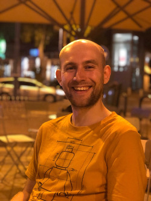

{:style="float: right; margin-left: 10px; margin-right: 0px; margin-top: 7px;"}
I am a Postdoctoral Researcher currently residing at [LadHyX, École Polytechnique](https://www.ladhyx.polytechnique.fr/fr/). In my research, I employ mathematical concepts from asymptotic analysis and dynamical systems theory to model the world around us. My work so far is focused on microfluidic systems ranging from the thin film flows actuated by surface acoustic waves to the symmetry-breaking bifurcations in chemically active microdroplets. Ultimately, my goal is to help the community by expressing complex physics and chemistry in compact, human-readable form.

**Contact me:** 
morozov (at) ladhyx.polytechnique.fr

**Resources:**
[Google Scholar,](https://scholar.google.fr/citations?user=JDWRMSUAAAAJ)
[ResearchGate](https://www.researchgate.net/profile/Matvey_Morozov)

